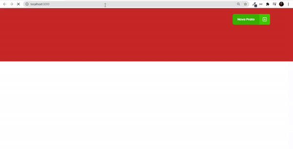

## Preview

<h1 align="center">
  
</h1>

## 💻 Project

Este projeto foi realizado com objetivo de estudo durante a jornada do GoStack.
<br />

É uma aplicação aplicação que irá se conectar a uma fake API, e exibir os pratos de comida criados e permitir a criação, remoção e atualização desses pratos.
<br />

## 🧬 Techologies

This project was developed using the following technologies:
 
- [React](https://pt-br.reactjs.org/)
- [Style-Components](https://styled-components.com/)
- [TypesScript](https://www.typescriptlang.org/)


## 🚀 Getting Started 

```bash
# install the dependecies 
$ npm install or yarn  
 
# Start projet
$ npm start or yarn run start
```

## 🎨 Layout 

You can view the project layout through the links below:

- [Layout web](https://www.figma.com/file/1lK6AVCPybtWeBLCH8B08N/GoRestaurant)

## 📝 License

This project is licensed under the MIT License. See the [LICENSE](https://github.com/AmandaCarvalho1989/go-restaurant/blob/main/LICENSE.md) file for details

